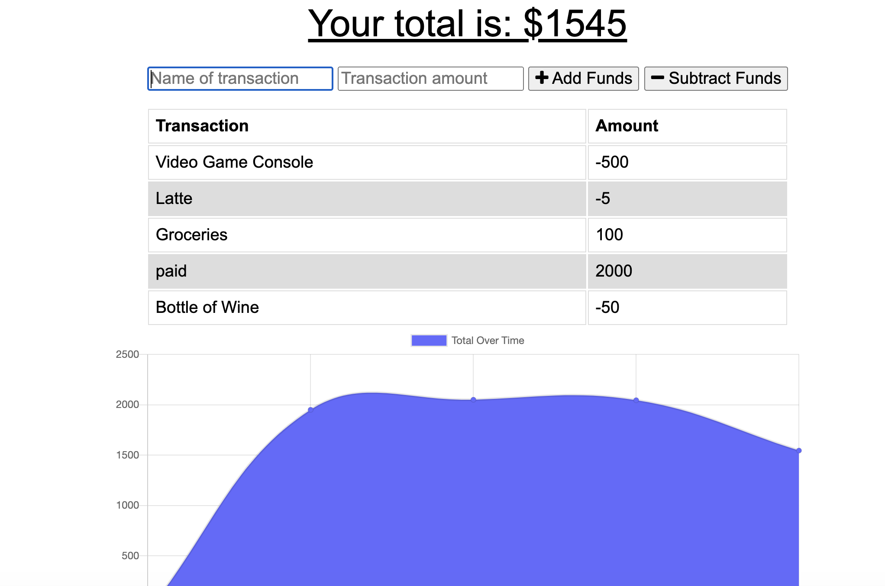

# budgetTracker

## Table of Contents
  1. [Description](#description)
  2. [Images of product](#screenshots)
  3. [Usage](#usage)
  4. [Questions](#questions)
  
  
  
## Description 
This Budget Tracker allows the user to keep track of their income and spending.  When the user adds an item, it will be stored in a database powered by MongoDB.  This application is a Progressive Web App, which will allow the user to continue enjoying the apps funcionality even when offline/there is no available internet.  When the internet service is restored, the information that has been indexed will be pushed to the database.

## Images of product 

## Usage 
To use, navigate to the app in your browser and begin adding budget items!

You can find the app [here](https://secure-hollows-10632.herokuapp.com/).

## Questions 
If you have any questions, you may reach out to me at richardwalter515@gmail.com
or visit me on [GitHub](https://www.github.com/richardwalter515)